# Дипломный практикум в Yandex.Cloud "Макарцев Александр Владимирович"
- [Дипломный практикум в Yandex.Cloud "Макарцев Александр Владимирович"](#дипломный-практикум-в-yandexcloud-макарцев-александр-владимирович)
  - [Цели:](#цели)
  - [Этапы выполнения:](#этапы-выполнения)
    - [Создание облачной инфраструктуры](#создание-облачной-инфраструктуры)
    - [Решение](#решение)
    - [Создание Kubernetes кластера](#создание-kubernetes-кластера)
    - [Решение](#решение-1)
    - [Создание тестового приложения](#создание-тестового-приложения)
    - [Решение](#решение-2)
    - [Подготовка cистемы мониторинга и деплой приложения](#подготовка-cистемы-мониторинга-и-деплой-приложения)
    - [Решение](#решение-3)
    - [Деплой инфраструктуры в terraform pipeline](#деплой-инфраструктуры-в-terraform-pipeline)
    - [Установка и настройка CI/CD](#установка-и-настройка-cicd)
    - [Решение](#решение-4)
  - [Что необходимо для сдачи задания?](#что-необходимо-для-сдачи-задания)

**Перед началом работы над дипломным заданием изучите [Инструкция по экономии облачных ресурсов](https://github.com/netology-code/devops-materials/blob/master/cloudwork.MD).**

---
## Цели:

1. Подготовить облачную инфраструктуру на базе облачного провайдера Яндекс.Облако.
2. Запустить и сконфигурировать Kubernetes кластер.
3. Установить и настроить систему мониторинга.
4. Настроить и автоматизировать сборку тестового приложения с использованием Docker-контейнеров.
5. Настроить CI для автоматической сборки и тестирования.
6. Настроить CD для автоматического развёртывания приложения.

---
## Этапы выполнения:


### Создание облачной инфраструктуры

Для начала необходимо подготовить облачную инфраструктуру в ЯО при помощи [Terraform](https://www.terraform.io/).

Особенности выполнения:

- Бюджет купона ограничен, что следует иметь в виду при проектировании инфраструктуры и использовании ресурсов;
Для облачного k8s используйте региональный мастер(неотказоустойчивый). Для self-hosted k8s минимизируйте ресурсы ВМ и долю ЦПУ. В обоих вариантах используйте прерываемые ВМ для worker nodes.

Предварительная подготовка к установке и запуску Kubernetes кластера.

1. Создайте сервисный аккаунт, который будет в дальнейшем использоваться Terraform для работы с инфраструктурой с необходимыми и достаточными правами. Не стоит использовать права суперпользователя
2. Подготовьте [backend](https://developer.hashicorp.com/terraform/language/backend) для Terraform:  
   а. Рекомендуемый вариант: S3 bucket в созданном ЯО аккаунте(создание бакета через TF)
   б. Альтернативный вариант:  [Terraform Cloud](https://app.terraform.io/)
3. Создайте конфигурацию Terrafrom, используя созданный бакет ранее как бекенд для хранения стейт файла. Конфигурации Terraform для создания сервисного аккаунта и бакета и основной инфраструктуры следует сохранить в разных папках.
4. Создайте VPC с подсетями в разных зонах доступности.
5. Убедитесь, что теперь вы можете выполнить команды `terraform destroy` и `terraform apply` без дополнительных ручных действий.
6. В случае использования [Terraform Cloud](https://app.terraform.io/) в качестве [backend](https://developer.hashicorp.com/terraform/language/backend) убедитесь, что применение изменений успешно проходит, используя web-интерфейс Terraform cloud.

Ожидаемые результаты:

1. Terraform сконфигурирован и создание инфраструктуры посредством Terraform возможно без дополнительных ручных действий, стейт основной конфигурации сохраняется в бакете или Terraform Cloud
2. Полученная конфигурация инфраструктуры является предварительной, поэтому в ходе дальнейшего выполнения задания возможны изменения.

### Решение

Основной [репозиторий](https://github.com/MakarAlexander/devops-diplom)

Сделана следующая разбивка:

- Конфигурация для создания сервисного аккаунта и бакета располагается [тут](./bucket/)

- Конфигурация для создания инстраструктуры и поднятия kubernetes [тут](./terraform/)

- Манифесты для поднятия ingress и сервисного аккаунта для github [тут](./deploy/)

Для минимизации ручный действий создал [```auto.sh```](auto.sh), поднимает всю инфрастуктуру, подключается к кластеру и создает DNS записи + запускает все манифесты.  
Для удаление инфрастуктуры используется [```purge.sh```](purge.sh)

Сохранение ```terraform.tfstate``` в бакет
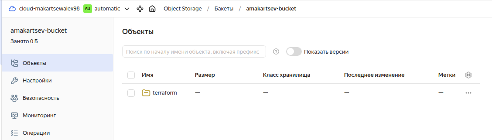

В результате формируется ```credfile.key```, который потом используется при инициализации основного терраформ кода тут: [providers.tf](./terraform/providers.tf)

Создание самого бакета происходит без проблем
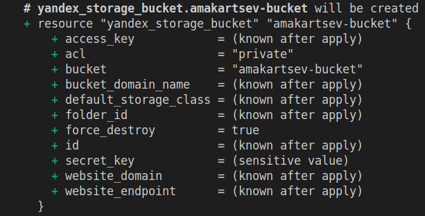
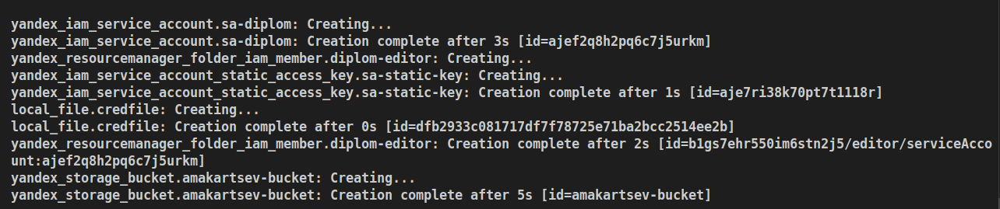

---
### Создание Kubernetes кластера

На этом этапе необходимо создать [Kubernetes](https://kubernetes.io/ru/docs/concepts/overview/what-is-kubernetes/) кластер на базе предварительно созданной инфраструктуры.   Требуется обеспечить доступ к ресурсам из Интернета.

Это можно сделать двумя способами:

1. Рекомендуемый вариант: самостоятельная установка Kubernetes кластера.  
   а. При помощи Terraform подготовить как минимум 3 виртуальных машины Compute Cloud для создания Kubernetes-кластера. Тип виртуальной машины следует выбрать самостоятельно с учётом требовании к производительности и стоимости. Если в дальнейшем поймете, что необходимо сменить тип инстанса, используйте Terraform для внесения изменений.  
   б. Подготовить [ansible](https://www.ansible.com/) конфигурации, можно воспользоваться, например [Kubespray](https://kubernetes.io/docs/setup/production-environment/tools/kubespray/)  
   в. Задеплоить Kubernetes на подготовленные ранее инстансы, в случае нехватки каких-либо ресурсов вы всегда можете создать их при помощи Terraform.
2. Альтернативный вариант: воспользуйтесь сервисом [Yandex Managed Service for Kubernetes](https://cloud.yandex.ru/services/managed-kubernetes)  
  а. С помощью terraform resource для [kubernetes](https://registry.terraform.io/providers/yandex-cloud/yandex/latest/docs/resources/kubernetes_cluster) создать **региональный** мастер kubernetes с размещением нод в разных 3 подсетях      
  б. С помощью terraform resource для [kubernetes node group](https://registry.terraform.io/providers/yandex-cloud/yandex/latest/docs/resources/kubernetes_node_group)
  
Ожидаемый результат:

1. Работоспособный Kubernetes кластер.
2. В файле `~/.kube/config` находятся данные для доступа к кластеру.
3. Команда `kubectl get pods --all-namespaces` отрабатывает без ошибок.

### Решение

При реализации воспользовался развертыванием через ```Yandex Managment Service for Kubernetes```

Поднимаются 3 сети, сервисный аккаунт для кластера, кластер в 3х зонах доступности, 3 нод группы ВМ по 1 ВМ в каждой зоне.

Кластер
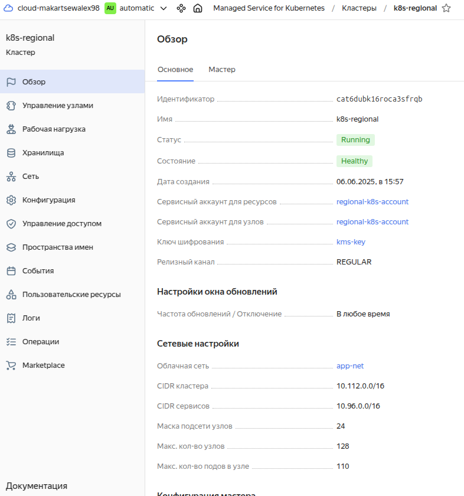
Нод-группы
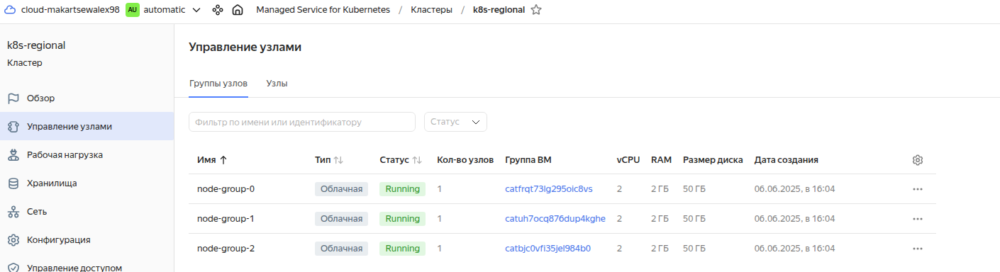
ВМ
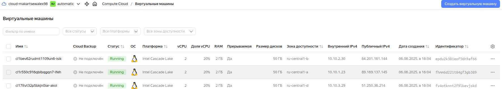
Вывод от ```terraform``` после инициализации
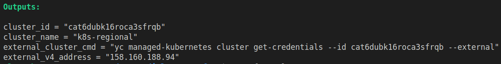

Подключаемся к нашему кластеру ```k8s```
```sh
yc managed-kubernetes cluster get-credentials --id [cluster_id] --external
```
Проверка ```kubectl get nodes```, ```kubectl get pods --all-namespaces``` и ```cat ~/.kube/config```
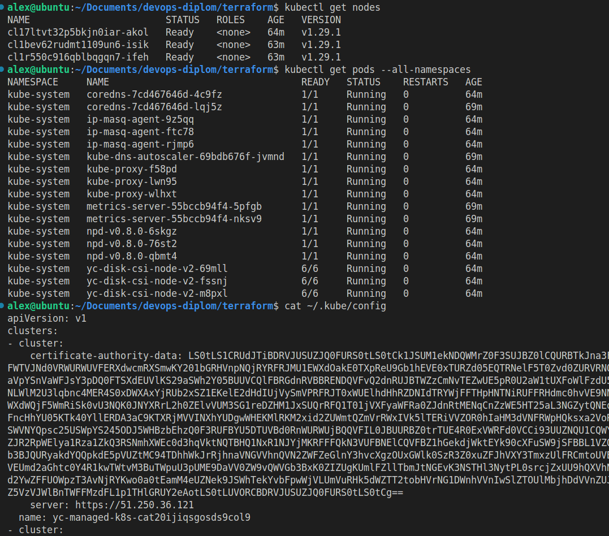

---
### Создание тестового приложения

Для перехода к следующему этапу необходимо подготовить тестовое приложение, эмулирующее основное приложение разрабатываемое вашей компанией.

Способ подготовки:

1. Рекомендуемый вариант:  
   а. Создайте отдельный git репозиторий с простым nginx конфигом, который будет отдавать статические данные.  
   б. Подготовьте Dockerfile для создания образа приложения.  
2. Альтернативный вариант:  
   а. Используйте любой другой код, главное, чтобы был самостоятельно создан Dockerfile.

Ожидаемый результат:

1. Git репозиторий с тестовым приложением и Dockerfile.
2. Регистри с собранным docker image. В качестве регистри может быть DockerHub или [Yandex Container Registry](https://cloud.yandex.ru/services/container-registry), созданный также с помощью terraform.

### Решение

Репозиторий со статическим [```nginx```](https://github.com/MakarAlexander/nginx-static)
[```Docker Hub```](https://hub.docker.com/r/makartsewalex98/static-nginx) куда заливается образ для деплоя

Создаем образ на основе ```Dockerfile``` и пушим в репозиторий с тегом ```init```
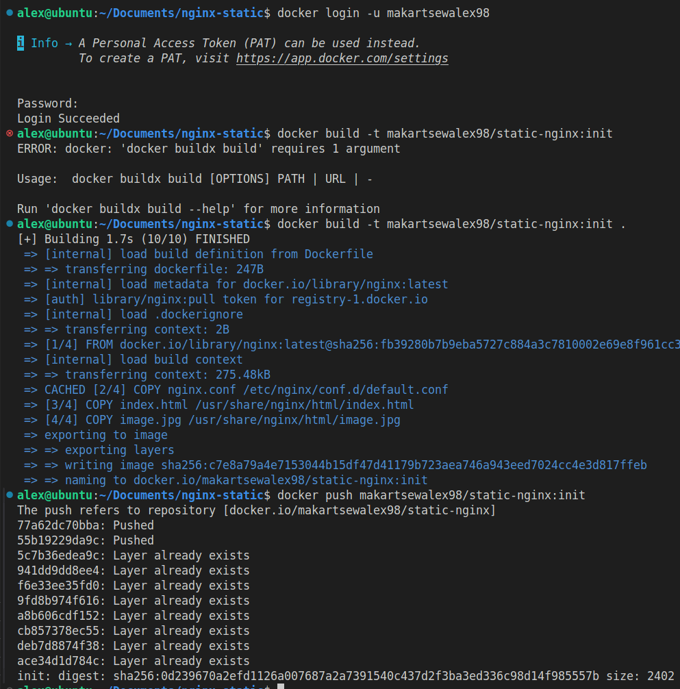
Локальная проверка образа, работает

Образ залитый на Docker hub
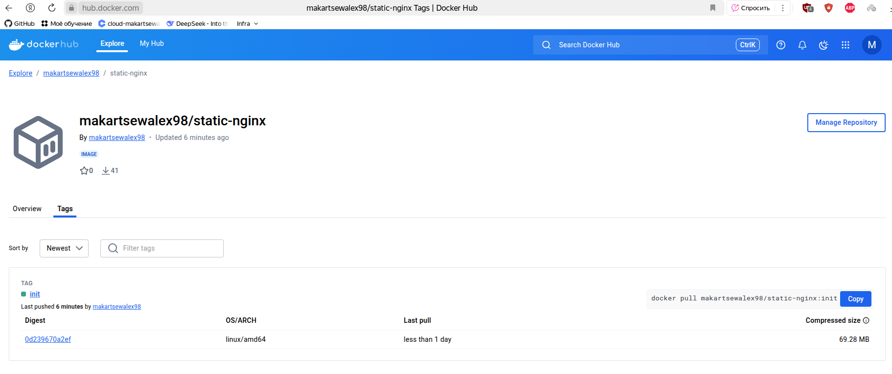

---
### Подготовка cистемы мониторинга и деплой приложения

Уже должны быть готовы конфигурации для автоматического создания облачной инфраструктуры и поднятия Kubernetes кластера.  
Теперь необходимо подготовить конфигурационные файлы для настройки нашего Kubernetes кластера.

Цель:
1. Задеплоить в кластер [prometheus](https://prometheus.io/), [grafana](https://grafana.com/), [alertmanager](https://github.com/prometheus/alertmanager), [экспортер](https://github.com/prometheus/node_exporter) основных метрик Kubernetes.
2. Задеплоить тестовое приложение, например, [nginx](https://www.nginx.com/) сервер отдающий статическую страницу.

Способ выполнения:
1. Воспользоваться пакетом [kube-prometheus](https://github.com/prometheus-operator/kube-prometheus), который уже включает в себя [Kubernetes оператор](https://operatorhub.io/) для [grafana](https://grafana.com/), [prometheus](https://prometheus.io/), [alertmanager](https://github.com/prometheus/alertmanager) и [node_exporter](https://github.com/prometheus/node_exporter). Альтернативный вариант - использовать набор helm чартов от [bitnami](https://github.com/bitnami/charts/tree/main/bitnami).

### Решение

Создаем ```namespace``` для проекта
```sh
kubectl create namespace project
```
Установка стека мониторинга через helm
```sh
helm repo add prometheus-community https://prometheus-community.github.io/helm-charts && \
helm repo update && \
helm install prometheus prometheus-community/kube-prometheus-stack --namespace=project || exit 1
```
Установка ingress через helm
```sh
helm repo add ingress-nginx https://kubernetes.github.io/ingress-nginx && \
helm repo update && \
helm install ingress-nginx ingress-nginx/ingress-nginx --namespace=project || exit 1
```
Деплой приложения из образа makartsewalex98/static-nginx:init, деплой сущности ингресс и создание сервисной учетной записи для CI/CD GitHub Actions
```sh
kubectl apply -f deployment.yml
kubectl apply -f ingress.yml
kubectl apply -f sa_for_github.yml
```
Для внешнего подключения к нашим сервисам настроим DNS на внешний IP адрес балансировщика:
Получение ip балансировщика
```sh
IP=$(yc load-balancer network-load-balancer list --format json | jq -r '.[0].listeners[0].address') || exit 1
```
Создание DNS зоны
```sh
yc dns zone create --name amakartsev \
  --zone "amakartsev.ru." \
  --public-visibility \
  --description "Публичная зона для домена amakartsev.ru" || exit 1
```
Создание А записей
```sh
for record in "@" app grafana; do
  yc dns zone add-records --name amakartsev \
    --record "$record 300 A $IP"
done
```
Проверка доступности сайта на 80 порту
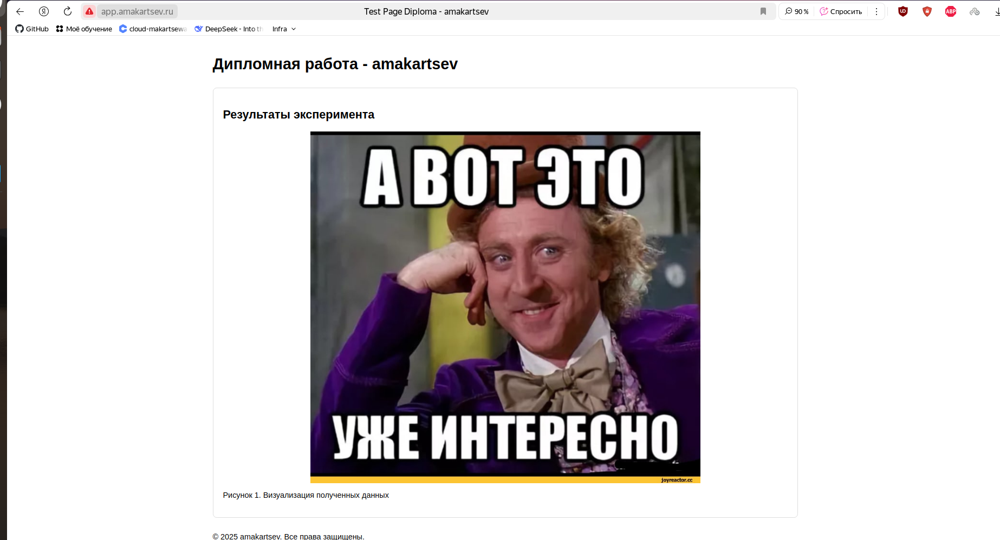
Проверка доступности grafana на 80 порту (admin/prom-operator)
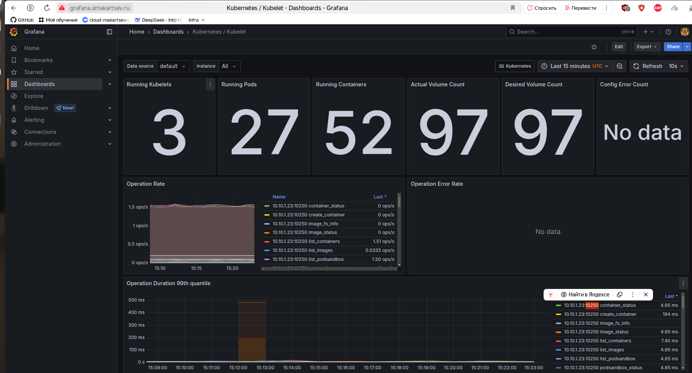

### Деплой инфраструктуры в terraform pipeline

1. Если на первом этапе вы не воспользовались [Terraform Cloud](https://app.terraform.io/), то задеплойте и настройте в кластере [atlantis](https://www.runatlantis.io/) для отслеживания изменений инфраструктуры. Альтернативный вариант 3 задания: вместо Terraform Cloud или atlantis настройте на автоматический запуск и применение конфигурации terraform из вашего git-репозитория в выбранной вами CI-CD системе при любом комите в main ветку. Предоставьте скриншоты работы пайплайна из CI/CD системы.

Ожидаемый результат:
1. Git репозиторий с конфигурационными файлами для настройки Kubernetes.
2. Http доступ на 80 порту к web интерфейсу grafana.
3. Дашборды в grafana отображающие состояние Kubernetes кластера.
4. Http доступ на 80 порту к тестовому приложению.
5. Atlantis или terraform cloud или ci/cd-terraform
---
### Установка и настройка CI/CD

Осталось настроить ci/cd систему для автоматической сборки docker image и деплоя приложения при изменении кода.

Цель:

1. Автоматическая сборка docker образа при коммите в репозиторий с тестовым приложением.
2. Автоматический деплой нового docker образа.

Можно использовать [teamcity](https://www.jetbrains.com/ru-ru/teamcity/), [jenkins](https://www.jenkins.io/), [GitLab CI](https://about.gitlab.com/stages-devops-lifecycle/continuous-integration/) или GitHub Actions.

Ожидаемый результат:

1. Интерфейс ci/cd сервиса доступен по http.
2. При любом коммите в репозиторие с тестовым приложением происходит сборка и отправка в регистр Docker образа.
3. При создании тега (например, v1.0.0) происходит сборка и отправка с соответствующим label в регистри, а также деплой соответствующего Docker образа в кластер Kubernetes.

### Решение

Воспользуемся GitHub Actions. Добавим несколько секретов:
- Docker_username
- Docker_token
- Статическую конфигурацию k8s

```Docker_username``` и ```Docker_token``` получаем с Docker Hub. Для k8s получение конфигурации описано в ```auto.sh```
Ручной момент для k8s остается и добавляем креды в github
```sh
cat test.kubeconfig | base64
```
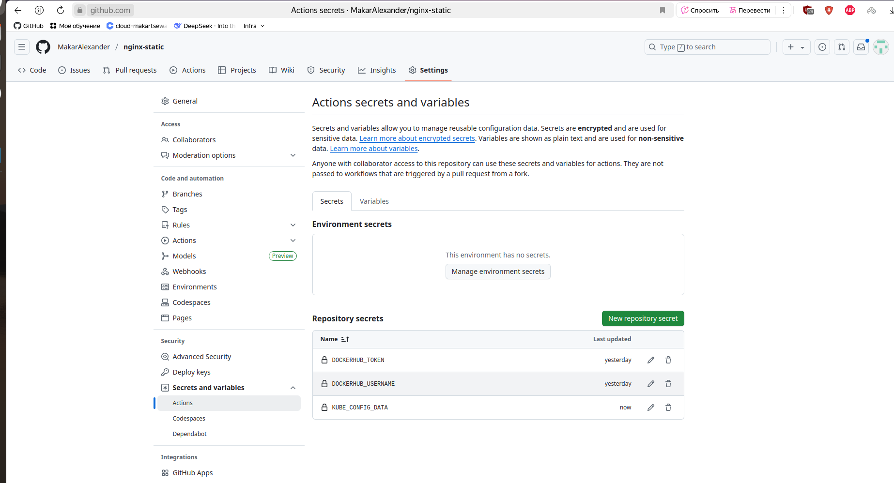

Секреты настроены. Теперь настраиваем [workflow](https://github.com/MakarAlexander/nginx-static/blob/main/.github/workflows/main.yml)
[Pipeline](https://github.com/MakarAlexander/nginx-static/actions) с указанием версии проходит успешно
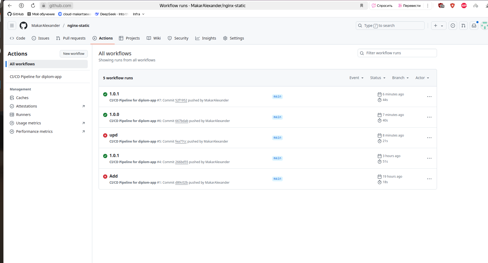
Версия с новым тегов сохраняется в Dockerhub
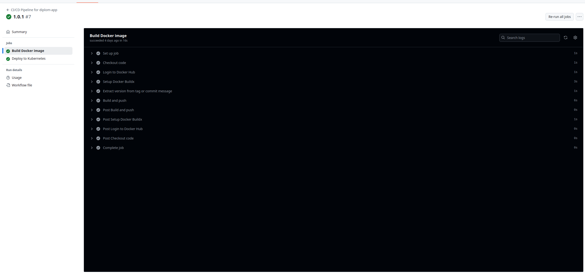

---
## Что необходимо для сдачи задания?

1. Репозиторий с конфигурационными файлами Terraform и готовность продемонстрировать создание всех ресурсов с нуля.
2. Пример pull request с комментариями созданными atlantis'ом или снимки экрана из Terraform Cloud или вашего CI-CD-terraform pipeline.
3. Репозиторий с конфигурацией ansible, если был выбран способ создания Kubernetes кластера при помощи ansible.
4. Репозиторий с Dockerfile тестового приложения и ссылка на собранный docker image.
5. Репозиторий с конфигурацией Kubernetes кластера.
6. Ссылка на тестовое приложение и веб интерфейс Grafana с данными доступа.
7. Все репозитории рекомендуется хранить на одном ресурсе (github, gitlab)